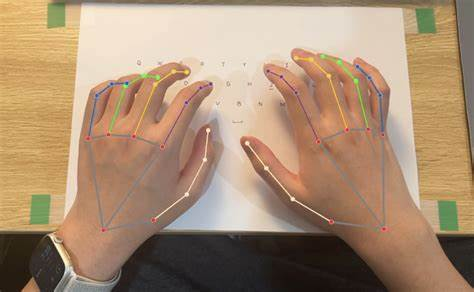

# 🤚 Hand Gesture Detection using MediaPipe

Welcome to the **Hand Gesture Detection** project! This application leverages the power of MediaPipe and OpenCV to recognize hand gestures in real-time through your webcam. It's a fun and interactive way to explore hand tracking technology and can be used for various applications, from gaming to virtual interfaces.

## 📸 Demo

  
*Watch how the system detects hand landmarks in real-time!*

## 🚀 Features

- **Real-Time Detection**: Detects and visualizes hand landmarks in real-time using your webcam.
- **User-Friendly Interface**: Simple display with clear visual feedback.
- **Hands-Free Control**: Potential applications for gesture-based control systems.

## 🛠️ Requirements

To run this project, you will need:

- Python 3.x
- OpenCV
- MediaPipe

## 📥 Installation

1. **Clone the repository**:

   ```bash
   git clone https://github.com/chrohangurjar1/hand-gesture-detection.git
   cd hand-gesture-detection
   ```

2. **Set up a virtual environment** (optional but recommended):

   ```bash
   python -m venv .venv
   source .venv/bin/activate  # On Windows use `.venv\Scripts\activate`
   ```

3. **Install dependencies**:

   ```bash
   pip install opencv-python mediapipe
   ```

## 🚀 Running the Project

To run the hand gesture detection application, use the following command:

```bash
python main.py
```

- **Press 'q'** to exit the program.

## 🎨 Code Overview

This project utilizes the following key components:

- **MediaPipe Hands**: For detecting and tracking hand landmarks.
- **OpenCV**: For capturing video from the webcam and displaying the output.

Here's a snippet of the core functionality:

```python
import cv2
import mediapipe as mp

# Initialize MediaPipe Hands
mp_hands = mp.solutions.hands
hands = mp_hands.Hands()
mp_drawing = mp.solutions.drawing_utils

# Capture video
cap = cv2.VideoCapture(0)

# Main loop for processing frames
while cap.isOpened():
    ret, frame = cap.read()
    # Additional processing here...
```

## 🐛 Issues

If you encounter any issues while using the application, please check the [Issues](https://github.com/yourusername/hand-gesture-detection/issues) section or feel free to create a new issue.

## 🤝 Contributing

Contributions are welcome! Feel free to submit a pull request or open an issue for discussion. 

## 📄 License

This project is licensed under the MIT License. See the [LICENSE](LICENSE) file for details.

## 📫 Contact

For any inquiries, please contact:

- **Your Name**: [your.email@example.com](mailto:your.email@example.com)
- **GitHub**: [Rohan Naagar](https://github.com/chrohangurjar1)

